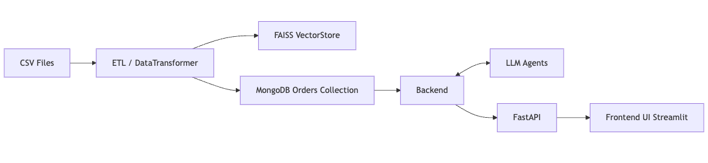
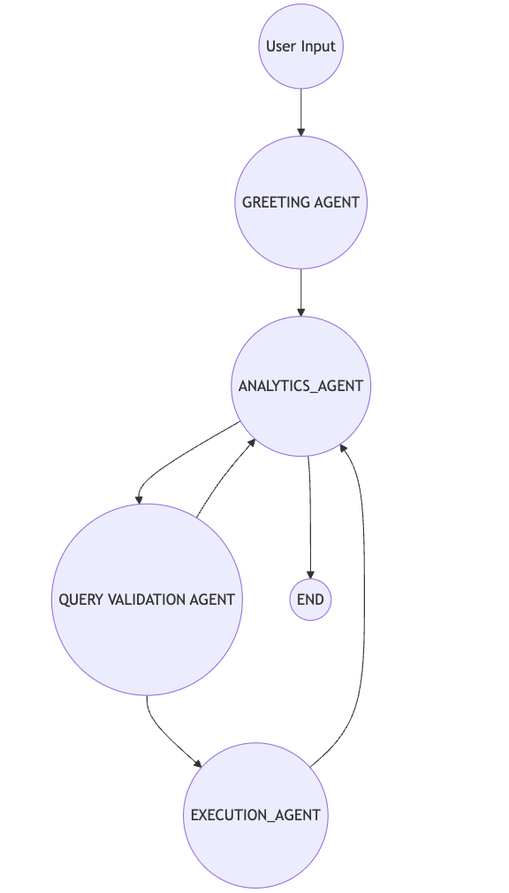
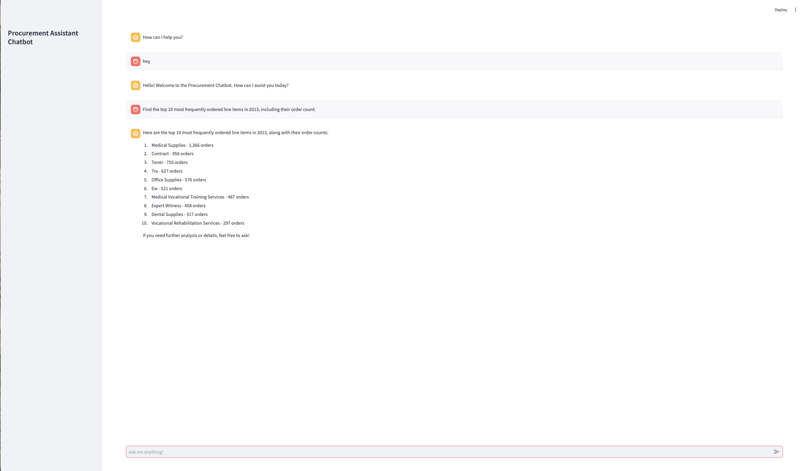

# Multi-Agent Procurement Assistant for Real-Time Data Insights

### Problem Description
Organizations managing extensive procurement operations often face challenges in efficiently extracting insights from large amounts of purchasing data. Important metrics such as order volumes, high-spending periods, and frequently ordered items are critical for informed decision-making, but manually analyzing this data can be labor-intensive and time-consuming.

This project addresses these challenges by developing an intelligent chat assistant that automates the retrieval of procurement insights. The assistant allows users to ask procurement-related questions and receive immediate, data-driven responses, empowering procurement teams to make faster and more informed decisions.

### Objective
To create a prototype assistant capable of answering queries related to procurement data. This includes:
- Total number of orders within specified periods.
- Identifying the quarter with the highest spending.
- Analyzing frequently ordered line items.
- Answering other relevant procurement-related inquiries.


## Project Overview
The Intelligent Procurement Assistant is a virtual assistant designed to streamline data-driven decision-making within procurement processes. This assistant allows procurement teams to interact with procurement data directly, answering questions about order trends, spending patterns, and frequently ordered items. By automating these insights, the assistant saves time and reduces the need for manual data analysis, empowering users to make faster and more informed purchasing decisions. 

## Dataset 
The dataset used in this project contains detailed procurement data, providing insights into purchasing trends, order volumes, and spending patterns. Key data points include:

- **Order Details**: Information on individual orders, including order numbers, dates, and amounts spent.
- **Time Periods**: Dates and timestamps that enable analysis by month, quarter, or year.
- **Items and Categories**: Details about the items purchased, including item descriptions, categories, and frequency of orders.
- **Spending Information**: Data on total spending per order, which allows for tracking of high-spending periods and analysis of spending trends over time.

This structured dataset is essential for powering the Intelligent Procurement Assistant you can find it through this link: https://www.kaggle.com/datasets/sohier/large-purchases-by-the-state-of-ca

## Technologies

- **Python 3.10**: The core programming language used for implementing the assistant's functionality, data processing, and handling user queries.
- **Docker and Docker Compose**: Used for containerization, ensuring that the project runs consistently across different environments by packaging dependencies and configurations together.
- **FAISS**: A library for efficient similarity search and clustering of dense vectors, enabling quick retrieval of relevant information from procurement data.
- **FastAPI**: A lightweight web framework used to create a user-friendly API that facilitates interaction between users and the assistant.
- **LangChain**: A framework for developing applications powered by language models, streamlining the integration of LLMs with tools, APIs, and custom workflows.
- **LangGraph**: A tool for building and visualizing graph-based workflows in applications that involve language models, enabling structured interaction and analysis of conversational flows.
- **Streamlit**: A tool building a simple chatbot UI.

## How to run
### Prerequisites

- Ensure you have **Docker** and **Docker Compose** installed on your machine.
- Install **Python 3.10** if you plan to run components locally without Docker.
- Make sure you have a running **MongoDB** container or instance.
---

### ETL

### Option 1: Run via Docker Compose
1. Navigate to the ETL component directory:
```bash
cd components/etl
```
2. Start the ETL service using Docker Compose:
```
docker-compose up
```
### Option 2: Run Locally
1.	Ensure that the MongoDB container is running:
```
docker run -d --name mongodb -p 27017:27017 mongo
```
2.	Run the ETL script directly:
```
python3 src/main.py
```
### Backend and Frontend
1.	In the main project folder, copy the .env.example file and rename it to .env:
```
cp .env.example .env
```
2.	Update the .env file with your configuration values.
3.	Start the backend and frontend services using Docker Compose:
```
docker-compose up
```
4.	Access the frontend UI at the following URL:
```
http://localhost:8081/
```

## Architecture

The system is divided into three major components:

1. **ETL**: Handles data ingestion and transformation, as well as creating embeddings and storing data in both a document-oriented database and a FAISS vector store.
2. **Backend**: Implements an agentic system to process user queries, orchestrate logic flows, and provide analytical or validated responses.
3. **Frontend**: Offers a simple, interactive user interface where users can converse with the assistant and obtain insights from the underlying data.


---

## ETL Process

1. **Data Reading**: Large CSV files containing procurement records are read in chunks.
2. **Transformation**: Each chunk undergoes cleaning, parsing, and validation steps, such as:
   - Converting date fields to standard formats.
   - Removing invalid or nonsensical values from numeric fields.
   - Fixing missing or skewed prices.
   - Normalizing text columns to a consistent format.
3. **Embedding Creation**: The transformed data—particularly item descriptions and commodity titles—undergoes embedding generation. These embeddings are stored in a FAISS vector index for efficient similarity search.
4. **Data Storage**:  
   - The structured procurement data (including line items) is stored in a MongoDB collection named **Order**.  
   - The FAISS vector store holds the associated embeddings for quick retrieval.

This approach ensures that the dataset is consistent, accurate, and optimized for both analytical queries and similarity-based lookups.

---

## Backend

The backend is powered by a **FastAPI** server, which exposes an agentic system. This system, built using **LangChain** and **LangGraph**, consists of various agents that coordinate to process user requests:

- **Greeting Agent**: Greets and confirms user intentions at the beginning of a conversation.
- **Analytics Agent**: Interprets user queries that require deeper data insights and analytics.
- **Validation Agent**: Ensures inputs or results meet specific criteria before proceeding.
- **Execution Agent**: Executes final actions (e.g., database queries, computations) and returns results.

A directed graph (or state graph) connects these agents, defining how conversations flow and ensuring each user query follows the proper processing steps.



---

## Frontend

A **Streamlit** application serves as a simple user interface for interacting with the Procurement Data Assistant. Users can type in their questions or requests, and the system responds with relevant analytical insights drawn from the backend. This interface makes the analytical capabilities accessible to non-technical users.


---


## API Endpoint

The primary endpoint exposed by the FastAPI backend for conversational queries is:

POST
```
http://localhost:8000/bot/v1/chat
```
**Request Body**:
```json
{
    "thread_id": "string",
    "user_message": "string"
}
```
•	thread_id: An identifier used to track the conversation thread.
•	user_message: The user’s question or command.

### Example Interaction

A sample request and response might look like this:

#### Request
```
{
    "thread_id": "123",
    "user_message": "Find the top 10 most frequently ordered line items in 2013, including their order count."
}
```


#### Response
```
{
    "bot_response": "Here are the top 10 most frequently ordered line items in 2013, along with their order counts:\n\n1. Medical Supplies - 1,366 orders\n2. Contract - 956 orders\n3. Toner - 755 orders\n4. Tra - 627 orders\n5. Office Supplies - 576 orders\n6. Ew - 521 orders\n7. Medical Vocational Training Services - 487 orders\n8. Expert Witness - 458 orders\n9. Dental Supplies - 317 orders\n10. Vocational Rehabilitation Services - 297 orders\n\nIf you need further analysis or details, feel free to ask!",
    "thread_id": "123"
}
```